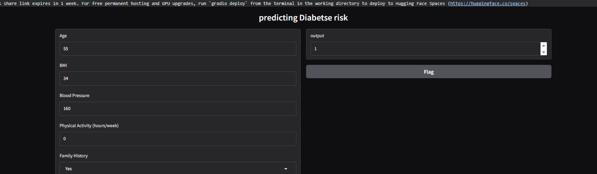

# Diabetes Risk Classification

A machine learning classification model to assess early risk of diabetes based on patient health indicators and diagnostic features.

## Project Structure
- **Code**: `ML_Diabetes_Risk_Classification (code).ipynb`
- **Dataset / Resources**: `diabetes_risk_dataset_text_labels.csv`
- **Documentation**: `README.md`

## Output


## Requirements
```bash
pip install pandas numpy scikit-learn matplotlib seaborn jupyter
```

## Usage
1. Clone the repository:
```bash
git clone https://github.com/Yuossef-Ashraf/ML_Diabetes_Risk_Classification.git
cd ML_Diabetes_Risk_Classification
```
2. Run the project:
```bash
jupyter notebook "ML_Diabetes_Risk_Classification (code).ipynb"
```

## Author
Yuossef Ashraf

## License
MIT License
