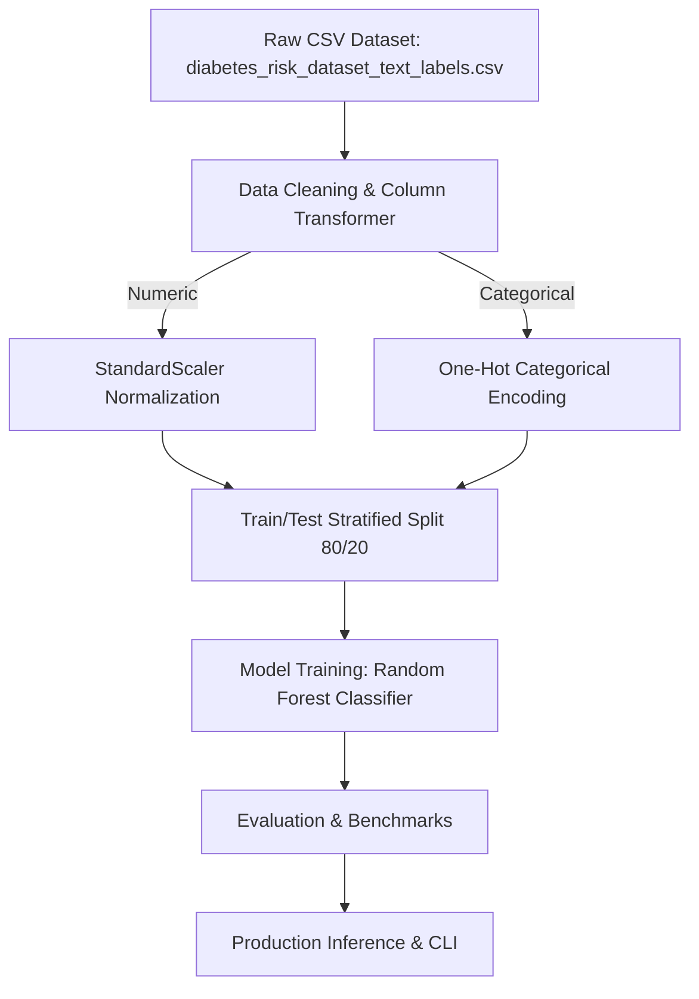

# Diabetes Risk Classification & Health Analytics - Architecture & Pipeline Design

## Comparative Models Evaluated
- **Random Forest Classifier**
- **XGBoost**
- **Logistic Regression**
- **Support Vector Machine**
